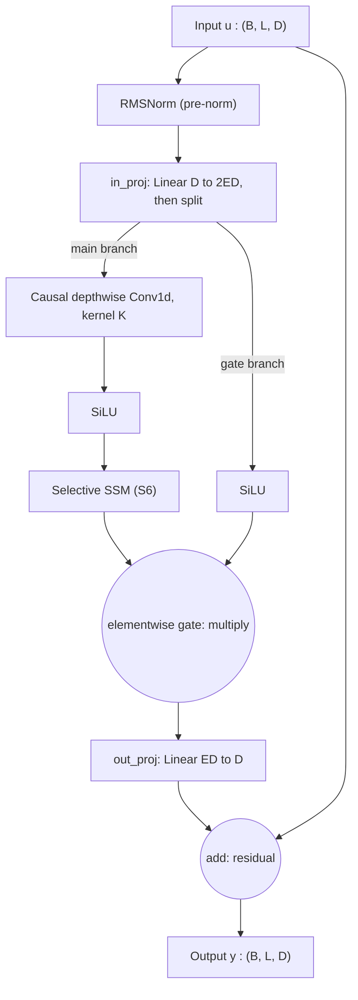
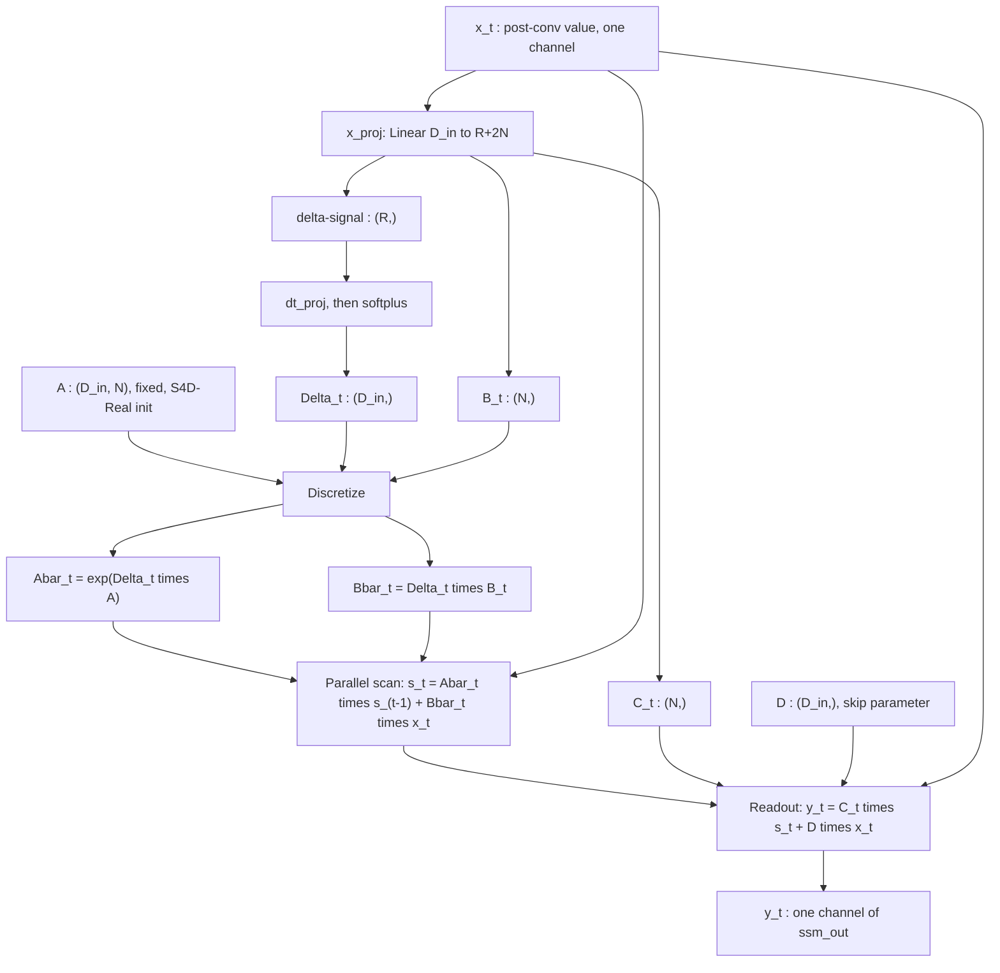

# Mamba / Selective SSMs: Technical Reference

Paper: [arXiv:2312.00752](https://arxiv.org/abs/2312.00752), "Mamba: Linear-Time Sequence Modeling with Selective State Spaces" (Gu & Dao, 2023).

Concrete, from-scratch build-up: why Transformers run into a scaling wall, why plain State Space Models are only a partial fix, how Mamba's selection mechanism closes the gap, the full forward pass with shapes and parameter counts, how training (loss and backprop) actually works, what Mamba still can't do, what the paper reports experimentally, and where this is headed as a foundation-model backbone. One numeric example is reused across every derivation section so each representation can be checked against the others.

---

# Part 1: Limitations of Transformers (the motivation)

Self-attention: $y_i = \sum_{j\le i} \text{softmax}(q_i\cdot k_j)\,v_j$.

- **Quadratic time.** Computing all pairwise scores $QK^\top$ costs $O(L^2 d)$ for sequence length $L$. Double the context and the compute goes up 4x.
- **Growing memory at inference.** Autoregressive generation needs a key-value (KV) cache holding every past key and value. The cache grows linearly with context, and it's the main practical bottleneck when serving long contexts.
- **No compression.** Attention doesn't summarize history into a fixed-size state. It keeps an exact, ever-growing record and re-searches all of it at every step. That's why it's so good at precise recall, and also why it's expensive.
- **The historical alternative.** Classical RNNs are $O(L)$ in time and $O(1)$ in memory, since they carry a fixed-size hidden state. But they're sequential, so you can't parallelize over time during training, and they suffer vanishing or exploding gradients over long sequences. In practice they also lagged Transformers in quality at scale.

This is the gap SSMs try to close: RNN-like efficiency (linear time, constant memory) without the RNN-era training and quality problems.

---

# Part 2: State Space Models: the promise, and where they still fail

## 2.1 The continuous SSM and discretization

Classical control-theory state space model:

$$x'(t) = Ax(t) + Bu(t) \qquad \text{(state evolution)}$$
$$y(t) = Cx(t) \qquad \text{(readout)}$$

$x(t)$ is the state, a compressed summary of everything seen so far (it lives in $\mathbb{R}^N$ per channel). $u(t)$ is the input, $y(t)$ is the output.

Discretizing with a simple Euler step turns this into a step-by-step recurrence:

$$x_t = \bar A x_{t-1} + \bar B u_t, \qquad \bar A = I + \Delta A, \qquad \bar B = \Delta B$$

where $\Delta$ is the step size. This is literally an RNN-shaped recurrence, with $\bar A, \bar B$ derived from the continuous parameters $A, B$ and the step size $\Delta$.

## 2.2 Eigenvalues, decay rate, and memory

Unroll $n$ steps: for a diagonal $\bar A$ with entry $1+\Delta\lambda$, after $n$ steps that entry contributes $(1+\Delta\lambda)^n$.

- A $\bar A$ value close to $1$ decays slowly, giving long memory.
- A $\bar A$ value further from $1$ (more negative $\lambda$, or a larger $\Delta$) decays fast, giving short memory.
- $|\bar A| > 1$ is unstable. Stability needs $|\bar A| \le 1$.

Why the state size $N$ matters: a diagonal $A$ gives $N$ different eigenvalues, i.e. $N$ different decay rates running in parallel inside one channel. A larger $N$ gives a finer bank of simultaneous timescales, which is why bigger state size is more expressive, not just "more numbers."

S4D-Real initialization, a scheme from the S4 (Structured State Space Sequence model) family, sets $A_n = -(n+1)$ for $n=0,\dots,N-1$, spreading timescales from slow to fast decay before training even starts.

## 2.3 Worked example (reused throughout this document)

Single channel, $N=2$, $L=3$. Continuous parameters $A=\text{diag}(-0.2,-1.6)$, $B=[1,1]$, $C=[1,1]$, $\Delta=0.5$, giving $\bar A=\text{diag}(0.9,0.2)$, $\bar B=[0.5,0.5]$.

Input $u=[2,-1,3]$, $x_0=[0,0]$:

$$x_1 = [1.0,\ 1.0] \quad y_1 = 2.0$$
$$x_2 = [0.4,\ -0.3] \quad y_2 = 0.1$$
$$x_3 = [1.86,\ 1.44] \quad y_3 = 3.30$$

At $t=2$, dimension 0 ($\bar A=0.9$) still remembers $u_1$; dimension 1 ($\bar A=0.2$) has already mostly forgotten it. Same recurrence, two different memory behaviors, purely from the two eigenvalues in $\bar A$.

## 2.4 How LTI SSMs get their efficiency: the recurrent/convolutional duality

"LTI" stands for linear time-invariant: the parameters $\bar A,\bar B,C$ are fixed and never change across positions or inputs. That assumption is exactly what makes the tricks in this section possible, and section 2.6 covers why it later becomes a limitation.

### 2.4.1 Where the kernel $K_k = C\bar A^k\bar B$ actually comes from

Start from the recurrence itself, $x_t = \bar A x_{t-1} + \bar B u_t$, with $x_0=0$, and just substitute forward, one step at a time, instead of asserting the closed form.

$$x_1 = \bar B u_1$$
$$x_2 = \bar A x_1 + \bar B u_2 = \bar A\bar B u_1 + \bar B u_2$$
$$x_3 = \bar A x_2 + \bar B u_3 = \bar A^2\bar B u_1 + \bar A\bar B u_2 + \bar B u_3$$

The pattern is now visible: every past input $u_k$ shows up scaled by $\bar A$ raised to however many steps have elapsed since it entered. In general,

$$x_t = \sum_{k=1}^{t} \bar A^{\,t-k}\bar B\, u_k$$

which you can also get formally by induction: it holds for $t=1$, and if it holds for $t-1$ then substituting into $x_t=\bar A x_{t-1}+\bar B u_t$ reproduces the same pattern with one more term. Apply the readout $y_t = Cx_t$ and relabel the summation index as the *lag* $j = t-k$ (so $j=0$ is the current step, $j=1$ is one step back, and so on):

$$y_t = \sum_{k=1}^{t} C\bar A^{\,t-k}\bar B\, u_k = \sum_{j=0}^{t-1} K_j\, u_{t-j}, \qquad K_j := C\bar A^{\,j}\bar B$$

That last relabeling step is the entire derivation: $K_j := C\bar A^j\bar B$ is nothing more than "how much a token from $j$ steps ago still shows up in today's output," and it falls straight out of unrolling the recurrence, with no extra assumption beyond $x_0=0$. Note also that $\bar A^0=I$, so $K_0=C\bar A^0\bar B=C\bar B$ always, the very first thing a token contributes before any decay has acted on it at all.

For our running example: $K_0=1.0$, $K_1=0.55$, $K_2=0.425$. Check: $y_1 = 1.0\cdot 2 = 2.0$, $y_2 = 0.55\cdot 2 + 1.0\cdot(-1) = 0.1$, $y_3 = 0.425\cdot 2 + 0.55\cdot(-1) + 1.0\cdot 3 = 3.30$. All match section 2.3 exactly.

Because $\bar A$ is diagonal, $\bar A^k$ is just an elementwise power, with no sequential dependency needed to build the kernel, so kernel construction is embarrassingly parallel. The kernel has shape $(D,L)$: the $N$ dimension gets contracted away, which is how prior LTI SSMs (S4) get a large $N$ essentially for free.

### 2.4.1b The raw $L\times L$ view: what $T$ actually is

Writing $y_t=\sum_{j\le t}K_{t-j}u_j$ out as a literal matrix-vector product makes the cost visible instead of hidden inside a summation. Define $T\in\mathbb{R}^{L\times L}$ entrywise, directly in terms of the kernel formula from 2.4.1:

$$T_{i,j} = C\bar A^{\,i-j}\bar B = K_{i-j} \ \text{ for } i\ge j, \qquad T_{i,j} = 0 \ \text{ for } i<j, \qquad\text{so that } y=Tu$$

Two structural properties fall straight out of that one definition:

- **Lower triangular**, because $T_{i,j}=0$ whenever $j>i$. That's causality written as a matrix: output $i$ is never allowed to depend on an input $j$ that hasn't happened yet.
- **Toeplitz**, meaning constant along every diagonal, because $T_{i,j}=C\bar A^{i-j}\bar B$ depends only on the lag $i-j$, never on $i$ and $j$ individually. This is a direct consequence of $\bar A,\bar B,C$ being fixed regardless of position: any two entries sharing the same lag are forced to be identical.

Written out fully for $L=3$, first in terms of the kernel entries, then via the $C\bar A^k\bar B$ formula, then with our running example's numbers substituted in (shown as plain grids rather than LaTeX matrices, since matrix environments don't render reliably on every markdown viewer, including GitHub):

```
        | K0   0    0  |        | C A^0 B     0        0     |        | 1.0    0     0   |
T   =   | K1   K0   0  |    =   | C A^1 B   C A^0 B     0     |    =   | 0.55  1.0    0   |
        | K2   K1   K0 |        | C A^2 B   C A^1 B   C A^0 B |        | 0.425 0.55  1.0  |
```
(writing $\bar A$ as `A` inside the grid since the bar doesn't render in plain text)

Checking $Tu$ directly against section 2.3's ground truth, row by row:

- row 1: $1.0\cdot2 = 2.0$
- row 2: $0.55\cdot2 + 1.0\cdot(-1) = 0.1$
- row 3: $0.425\cdot2 + 0.55\cdot(-1) + 1.0\cdot3 = 3.30$

matching $y_1,y_2,y_3$ exactly.

**Why the constant-diagonal property matters, and why it's the first thing selectivity destroys**: it only holds because $\bar A,\bar B,C$ never change with position. The moment Mamba makes $\bar A_t$ depend on $t$ (section 3.2), same-lag entries like $T_{3,1}$ and $T_{4,2}$ stop being forced equal, since different $\bar A_t$'s now sit in between them, so $T$ stops being Toeplitz. That's the precise, matrix-level version of "selectivity breaks the fixed kernel," stated there in terms of $K$ and restated here as $T$ losing its constant diagonals.

**The waste $T$ carries, which is exactly what the rest of section 2.4 exploits**: $T$ occupies $L^2$ slots per channel, but only $L$ distinct numbers, $K_0,\dots,K_{L-1}$, ever appear in it, each one repeated along its own diagonal. Computing $Tu$ densely costs $O(D\cdot L^2)$ per batch element, $O(B\cdot D\cdot L^2)$ overall: the same order as forming $QK^\top$ in attention, and for the same reason, a generic dense matrix needs all $L^2$ entries to be independently meaningful, and building it explicitly means paying for all of them. $T$'s redundancy, only $L$ unique numbers instead of $L^2$, is precisely the structure the Fast Fourier Transform (FFT) trick (2.4.2) and the parallel scan (3.3) each exploit, in different ways, to avoid ever materializing $T$ at all. No advantage over attention exists without one of those two tricks.

### 2.4.2 The FFT fix, worked through properly

**The intuition first, before any algebra.** A Fourier transform re-expresses a sequence as a sum of complex sinusoids, i.e. a change of basis. Complex exponentials are special with respect to shifting: shifting $e^{i\theta n}$ by one step just multiplies it by the fixed scalar $e^{-i\theta}$, which depends only on the frequency $\theta$, never on the position $n$. A convolution, $\sum_k K_k u_{t-k}$, is literally a weighted sum of shifted copies of $u$. So in the Fourier basis, every shift is "multiply by a scalar," and a weighted sum of shifts becomes a weighted sum of scalar multiplications, which collapses to a single multiplication per frequency. That is the entire content of the convolution theorem: **convolution in time becomes elementwise multiplication in frequency**, because shifts are diagonal in the Fourier basis.

**The algebra**, for a length-$N$ circular convolution $y[n]=\sum_{k=0}^{N-1}K[k]\,u[(n-k)\bmod N]$, using the Discrete Fourier Transform (DFT), $\hat f[\phi]=\sum_n f[n]e^{-i2\pi\phi n/N}$:

$$\hat y[\phi] = \sum_n y[n]e^{-i2\pi\phi n/N} = \sum_n\sum_k K[k]\,u[(n-k)\bmod N]\,e^{-i2\pi\phi n/N}$$

Substitute $m=(n-k)\bmod N$, so $n=m+k$:

$$= \sum_k K[k] \sum_m u[m]\,e^{-i2\pi\phi(m+k)/N} = \sum_k K[k]\,e^{-i2\pi\phi k/N} \sum_m u[m]\,e^{-i2\pi\phi m/N} = \hat K[\phi]\,\hat u[\phi]$$

The one step doing all the work is $e^{-i2\pi\phi(m+k)/N}=e^{-i2\pi\phi m/N}\cdot e^{-i2\pi\phi k/N}$: the exponent of a sum splits into a product of exponents, which separates "what depends on $m$" from "what depends on $k$." That is the same kind of move as pulling $q_i$ out of the linear-attention sum, or the associativity behind the parallel scan's $\oplus$ rule earlier in this document: find the place where two indices can be decoupled, and a sequential-looking computation turns parallel.

**A small numeric check**, using length $N=2$ so the roots of unity are just $\pm1$ (no complex arithmetic needed). Take $a=[1,2]$, $b=[3,4]$ (a generic pair, unrelated to the SSM example, just to verify the mechanism). Direct circular convolution: $c[0]=a_0b_0+a_1b_1=1\cdot3+2\cdot4=11$, $c[1]=a_0b_1+a_1b_0=1\cdot4+2\cdot3=10$, so $c=[11,10]$.

Via the DFT with $\omega=e^{-i\pi}=-1$: $\hat a=[a_0+a_1,\ a_0-a_1]=[3,-1]$, $\hat b=[b_0+b_1,\ b_0-b_1]=[7,-1]$. Elementwise multiply: $\hat c=[3\cdot7,\ (-1)\cdot(-1)]=[21,1]$. Inverse DFT ($\frac12\sum_\phi \hat c[\phi]\omega^{-\phi n}$, and $\omega^{-1}=\omega$ here since $N=2$): $c[0]=\frac12(21+1)=11$, $c[1]=\frac12(21-1)=10$. Matches the direct computation exactly, confirming the theorem holds, not just asymptotically but on an actual pair of numbers.

**Why this is fast**: a naive DFT costs $O(N^2)$, since each of $N$ output frequencies is its own $O(N)$ sum. The FFT (Cooley-Tukey) recursively splits that sum into its even- and odd-indexed terms, each a DFT of half the size, and combines the two halves in $O(N)$ work. With $\log_2 N$ levels of splitting, total work is $O(N\log N)$, the same divide-and-conquer flavor as the parallel scan's $O(\log L)$-depth argument, just applied to work instead of depth.

**The catch, and the fix**: FFT computes a *circular* convolution, but we need a *causal* one. Unpadded, using our original kernel and input, $y_0 = 1.0\cdot 2 + 0.55\cdot 3 + 0.425\cdot(-1) = 3.225 \ne 2.0$, since the "future" values $u_2,u_3$ illegally wrap around into $y_0$. The fix is to zero-pad both $K$ and $u$ to length $\ge 2L-1$ before transforming. Padding to length 6, $K=[1.0,0.55,0.425,0,0,0]$ and $u=[2,-1,3,0,0,0]$, the wraparound terms now land on zeros: $y_0 = K_0u_0 + K_1u_5+K_2u_4+\cdots = 1.0\cdot2+0+0=2.0$, correct again.

**The full pipeline**, putting it all together: zero-pad $K,u$ to length $M\ge2L-1$, compute $\hat K=\text{FFT}(K)$ and $\hat u=\text{FFT}(u)$ (each $O(M\log M)$), multiply elementwise $\hat y=\hat K\odot\hat u$ ($O(M)$), apply the inverse FFT (IFFT), $y=\text{IFFT}(\hat y)$ ($O(M\log M)$), then truncate to the first $L$ entries. Total cost $O(M\log M)=O(L\log L)$ since $M=O(L)$, replacing the $O(L^2)$ dense matmul entirely, as long as $\bar A,\bar B,C$ stay fixed across positions.

Complexity comparison:

| Method | Complexity | Notes |
|---|---|---|
| Raw dense $L\times L$ matmul | $O(B\cdot D\cdot L^2)$ | same order as attention |
| FFT convolution | $O(B\cdot D\cdot L\log L)$ | only valid when $\bar A,\bar B,C$ are fixed (LTI) |
| Recurrent scan | $O(B\cdot L\cdot D\cdot N)$ | linear in $L$, works for LTI and LTV (linear time-varying) alike |

## 2.5 Multi-channel worked example, and a first look at depthwise convolution

Section 2.3 only used one channel, so it never had to show what changes when $D>1$. This section fills that gap directly, then uses the same "stay independent per channel" idea to explain the depthwise convolution that shows up later in the Mamba block.

### 2.5.1 Extending to D channels: a full worked example

In the general (pre-Mamba) SSM, each channel is its own independent SISO (single-input, single-output) system: its own $A^{(d)}$, its own $B^{(d)}$, its own $C^{(d)}$. Stacking $D$ of these side by side is what turns a single-channel SSM into a $D$-channel one. Nothing about the recurrence changes; you just run the same machinery $D$ times, once per channel, with different numbers each time.

Keep channel 0 exactly as it was in section 2.3: $\bar A^{(0)} = \text{diag}(0.9, 0.2)$, $\bar B^{(0)} = [0.5,0.5]$, $C^{(0)} = [1,1]$, driven by $u_t^{(0)} = 2, -1, 3$ for $t=1,2,3$.

Add a second channel with deliberately different numbers, so it's obvious nothing is shared: $A^{(1)} = \text{diag}(-0.4,-1.2)$, $B^{(1)} = [2, 0.5]$, $C^{(1)} = [1,2]$, with $\Delta = 0.5$ as before. Discretizing gives $\bar A^{(1)} = \text{diag}(0.8, 0.4)$ and $\bar B^{(1)} = [1.0, 0.25]$. Drive it with its own input sequence $u_t^{(1)} = 1, 1, -2$.

So at each time step the model actually sees a $D=2$ vector $u_t = [u_t^{(0)}, u_t^{(1)}]$: $u_1=[2,1]$, $u_2=[-1,1]$, $u_3=[3,-2]$.

Running channel 1's recurrence on its own, completely independently of channel 0:

$$x_1^{(1)} = \bar A^{(1)} x_0^{(1)} + \bar B^{(1)} u_1^{(1)} = [0.8\cdot0+1.0\cdot1,\ 0.4\cdot0+0.25\cdot1] = [1.0, 0.25], \qquad y_1^{(1)} = 1\cdot1.0+2\cdot0.25 = 1.5$$
$$x_2^{(1)} = [0.8\cdot1.0+1.0\cdot1,\ 0.4\cdot0.25+0.25\cdot1] = [1.8, 0.35], \qquad y_2^{(1)} = 1\cdot1.8+2\cdot0.35 = 2.5$$
$$x_3^{(1)} = [0.8\cdot1.8+1.0\cdot(-2),\ 0.4\cdot0.35+0.25\cdot(-2)] = [-0.56, -0.36], \qquad y_3^{(1)} = 1\cdot(-0.56)+2\cdot(-0.36) = -1.28$$

Now stack both channels together and look at the shapes that fall out (shown as plain grids, not LaTeX matrices, since matrix environments don't render reliably on every markdown viewer, including GitHub):

```
u  =  |  2   1 |     shape (L,D) = (3,2)
      | -1   1 |
      |  3  -2 |
```

```
x1 = | 1.0  1.0  |     x2 = | 0.4  -0.3 |     x3 = |  1.86   1.44 |
     | 1.0  0.25 |          | 1.8   0.35|          | -0.56  -0.36 |
                    each shape (D,N) = (2,2)
```

```
y  =  | 2.0    1.5  |     shape (L,D) = (3,2)
      | 0.1    2.5  |
      | 3.30  -1.28 |
```

That is exactly where $(B,L,D)$ for $u$ and $y$, and $(B,L,D,N)$ for $x$, come from: $D$ completely independent single-channel SSMs, each with its own $N$-dimensional state, stacked along a new axis. Nothing in this computation ever mixes channel 0's numbers with channel 1's. The cost per time step is $D$ separate chunks of $O(N)$ work, giving $O(D\cdot N)$ per step and $O(L\cdot D\cdot N)$ overall, which is exactly the recurrent-scan row of the complexity table above.

### 2.5.2 Depthwise causal convolution: the same "stay per-channel" idea, applied to a local window

The Mamba block (introduced fully in Part 3.6) runs a short convolution over the sequence before the SSM. It is worth understanding on its own, because it reuses the exact independence property just derived, applied to a much simpler operation than the scan.

A regular 1D convolution over $D_{in}$ channels mixes all of them together: each output channel is a weighted sum over *every* input channel's local window, with a kernel of shape $(D_{out}, D_{in}, K)$, costing $O(L\cdot D_{out}\cdot D_{in}\cdot K)$. That reintroduces exactly the $D\times D$ mixing cost the rest of the architecture goes out of its way to avoid.

A **depthwise** convolution removes the cross-channel mixing entirely: channel $d$'s output depends only on channel $d$'s own local window of the past $K$ steps, using a filter $w^{(d)}$ that belongs to that channel alone. The kernel shape shrinks to $(D,K)$, and the cost drops to $O(L\cdot D\cdot K)$, matching the $D_{in}K$ parameter count already used in the Part 4 table.

**Causal** means the window only ever looks backward: pad $K-1$ zeros onto the left of the sequence before convolving, so the output at position $t$ only depends on inputs at positions $t-K+1,\dots,t$, never on anything at $t+1$ or later. This is the same causality requirement the scan itself has to respect.

Formally, for one channel with filter $w=(w_0,\dots,w_{K-1})$ and (left) zero-padded input $p$:

$$\tilde v_t = \sum_{k=0}^{K-1} w_k\, p_{t-K+1+k}, \qquad p_{t'} = 0 \text{ for } t' \le 0$$

Worked example, $K=3$, one channel, filter $w=[0.2, 0.5, 0.3]$ (oldest to most recent), raw sequence $v = [1, 2, -1, 3]$. Padded: $p_{-1}=0, p_0=0, p_1=1, p_2=2, p_3=-1, p_4=3$.

$$\tilde v_1 = 0.2\cdot p_{-1} + 0.5\cdot p_0 + 0.3\cdot p_1 = 0.2\cdot0+0.5\cdot0+0.3\cdot1 = 0.3$$
$$\tilde v_2 = 0.2\cdot p_0 + 0.5\cdot p_1 + 0.3\cdot p_2 = 0.2\cdot0+0.5\cdot1+0.3\cdot2 = 1.1$$
$$\tilde v_3 = 0.2\cdot p_1 + 0.5\cdot p_2 + 0.3\cdot p_3 = 0.2\cdot1+0.5\cdot2+0.3\cdot(-1) = 0.9$$
$$\tilde v_4 = 0.2\cdot p_2 + 0.5\cdot p_3 + 0.3\cdot p_4 = 0.2\cdot2+0.5\cdot(-1)+0.3\cdot3 = 0.8$$

Check causality directly: $\tilde v_1 = 0.3$ was computed using only $p_{-1},p_0,p_1$, i.e. only $v_1$ and two zeros. It never touched $v_2, v_3, v_4$, exactly as required.

In the Mamba block this same filter is applied independently to every one of the $D_{in}$ channels, each with its own separate $K$ weights (plus its own bias), which is exactly the $D_{in}K + D_{in}$ parameter count in the Part 4 forward-pass table. The purpose is cheap and local: give each channel a few tokens of nearby context (smoothing over the last $K-1$ steps) before the expensive, content-aware, long-range mixing happens inside the selective SSM. It costs almost nothing next to the $3ED^2$ of the projections, but the paper finds it matters empirically, likely because it lets immediately adjacent tokens interact directly, complementing what the SSM's decay-weighted state does over longer ranges.

## 2.6 Where LTI SSMs fail: two diagnostic tests

Everything above assumes $A,B,C,\Delta$ are fixed and never look at the input's content. That's what "linear time-invariant" (LTI) means. It's what buys the FFT trick, but it also means the model's dynamics are identical no matter what token is actually flowing through, so there's no way to react to content. Two synthetic tasks from the Mamba paper make this failure concrete.

**Selective Copying.** A sequence has a handful of "data" tokens scattered at random positions among many blank filler tokens. The task is to output just the data tokens, in order, ignoring the blanks. Compare this to the classic (non-selective) copying task, where the data always sits at fixed positions: that version is solvable with a constant, content-independent time delay, which is exactly what a fixed convolution kernel is. An LTI SSM handles it trivially. Selective Copying can't be solved that way, because which positions matter changes from example to example, so the model has to decide, from content alone, whether the current token is worth keeping. Since $\bar A,\bar B$ never look at the input, an LTI SSM treats a blank and a data token identically. It has no way to filter. S4-style models fail this test, while attention (a native content-based lookup) solves it easily.

**Induction Heads.** A sequence contains a pattern like "... A B ... A ?", and the correct completion is "B": the model has to notice that the current token A appeared earlier, recall what followed it that time, and repeat it. The gap between the two occurrences of A varies per example. The name comes from "induction heads," an attention-head circuit identified in interpretability research (Anthropic's *In-Context Learning and Induction Heads*) as a major driver of Transformers' in-context learning ability, which is why success or failure on this task is treated as a proxy for a model's broader in-context learning capacity. Solving it needs a content-based associative match ("has this exact token shown up before?") plus recall at an arbitrary, variable lag. A fixed convolution kernel only encodes fixed time lags, i.e. "look back exactly $k$ steps," so it has no way to search for "wherever A last occurred." LTI SSMs fail for the same underlying reason as Selective Copying: nothing in the system depends on content.

Why these two tests matter: they isolate, in the smallest possible synthetic setting, exactly the capability real language needs, which is filtering irrelevant content and performing variable-length, content-triggered recall. They show that being an SSM and being efficient isn't enough. Something has to make the dynamics content-aware.

---

# Part 3: How Mamba (S6) fixes this

## 3.1 Selectivity: the core idea

S4 (LTI) keeps $A,B,C,\Delta$ fixed, with no time index at all, identical for every position and every sequence.

Mamba, which the paper calls S6 (its own shorthand for "Selective SSM," since it's an S4-style model with Selection, computed via a Scan), makes $\Delta_t, B_t, C_t$ functions of the current input $u_t$ (small linear projections). $A$ itself stays fixed; it only becomes indirectly time-varying through $\bar A_t = \exp(\Delta_t A)$, since $\Delta_t$ now changes at every position.

Mechanistically, $\Delta_t$ acts as a content-aware gate on $x_t = \bar A_t x_{t-1} + \bar B_t u_t$:

- a small $\Delta_t$ pushes $\bar A_t \approx I$, so the state barely updates. The model can learn to effectively ignore an irrelevant or blank token, which is exactly what solves Selective Copying: small $\Delta_t$ on filler, larger $\Delta_t$ on data.
- a large $\Delta_t$ pushes $\bar A_t \to 0$, flushing the old state and resetting it with the new input.

For Induction Heads, the paper shows Mamba solves the task and generalizes to sequences much longer than it was trained on, and attributes this to the same selection mechanism. Unlike Selective Copying's clean "gate open or shut" story, though, the paper doesn't claim as literal a circuit-level explanation as Transformer induction heads. It's more of an empirical result than a fully traced mechanism.

## 3.2 The cost: selectivity breaks the free lunch

An input-dependent $\bar A_t$ means the kernel is no longer shared across positions, so it's not Toeplitz anymore. A direct check: compare $K_{3,1}$ against $K_{4,2}$, the same lag-2 gap. Under LTI these would be equal, since the diagonal is constant. Under selectivity they generally differ, because the $\bar A_t$'s in between are different at different absolute positions. No fixed kernel exists anymore, so there's no FFT trick available. Naively, that forces a fully sequential recurrence with $O(L)$ depth.

## 3.3 The fix: parallel scan

Reframe each step $x_t = a_t x_{t-1} + b_t$ as an affine map, encoded as a pair $e_t = (a_t, b_t)$. Composing two steps gives:

$$(a_1,b_1) \oplus (a_2,b_2) = (a_2 a_1,\ a_2 b_1 + b_2)$$

This is associative, since function composition always is, and the algebra never required $a_1 = a_2$. It holds whether the per-step transition is fixed (LTI) or different at every step (selective). That's exactly why the scan survives selectivity while FFT doesn't: FFT needs shift-invariance, meaning equal $a$'s everywhere, while the scan only needs associativity.

Checked with unequal multipliers ($a_1=0.9, b_1=1.0$; $a_2=0.3, b_2=2.0$): the sequential computation gives $x_2 = 2.3$, and the combined pair $(0.27, 2.3)$ applied to $x_0=0$ also gives $2.3$.

A worked Hillis-Steele scan with $L=4$, $\bar A=0.9$, $\bar B=0.5$, $u=[2,-1,3,1]$: two rounds of pairwise combination, each round reading from a frozen snapshot of the previous round, recover $x_1=1.0$, $x_2=0.4$, $x_3=1.86$, $x_4=2.174$ exactly, matching the sequential ground truth, in $\log_2 4 = 2$ rounds instead of 4 dependent steps.

### 3.3.1 Why the depth is exactly $O(\log L)$, worked out in full

**Setting up precisely what a "round" is.** Round $r$ (for $r=1,2,3,\dots$) uses offset $2^{r-1}$: every position $i$ combines its current value with the current value sitting $2^{r-1}$ positions to its left, $\text{new}[i] = \text{old}[i-2^{r-1}] \oplus \text{old}[i]$, provided $i-2^{r-1}\ge 1$; otherwise position $i$ is left untouched this round. "Current" always means the value as it stood *before this round started* (the frozen-snapshot rule from the $L=4$ example above) — that is precisely what makes every position's update in a round independent of every other position's update in the same round, i.e. genuinely parallel.

**The claim to prove**: after $r$ rounds, position $i$ holds the $\oplus$-combination of the raw elements in the window $[\max(1,\ i-2^r+1),\ i]$, a window of length $\min(i, 2^r)$ ending at $i$.

*Base case* ($r=0$, no rounds run yet): position $i$ just holds its own raw element $e_i$, a window of length $1=2^0$ ending at $i$. Matches the claim.

*Inductive step*: suppose the claim holds after round $r$. At round $r+1$ (offset $2^r$), position $i$ either:
- has no valid partner ($i \le 2^r$), meaning its round-$r$ window already starts at $1$, i.e. it already holds the *complete* prefix $[1,i]$. Nothing is gained by combining further, so leaving it unchanged is exactly correct, not a shortcut.
- has a valid partner at $i-2^r$. By the inductive hypothesis, position $i$'s own window is $[\,i-2^r+1,\ i\,]$ (length $2^r$) and position $i-2^r$'s window is $[\,i-2^{r+1}+1,\ i-2^r\,]$ (length $2^r$). These two windows are adjacent, with no gap and no overlap: one ends exactly one index before the other begins. Combining them with $\oplus$ (applying the earlier-time one first, since $\oplus$ is order-sensitive but associative, not commutative) concatenates them into a single window $[\,i-2^{r+1}+1,\ i\,]$, length $2^{r+1}$. The window has exactly doubled.

That is the entire mechanism, made precise: each round either doubles a position's reach or confirms it has already reached the start. A position is *converged* (holds the true, complete prefix combination it needs for a correct $x_i$) exactly when its window length $2^r \ge i$, i.e. when $r \ge \log_2 i$. The last element, $i=L$, is always the slowest to converge, needing $r \ge \log_2 L$, so $r=\lceil \log_2 L\rceil$ rounds are enough to guarantee **every** position has converged simultaneously. That is where "$O(\log L)$ depth" comes from, not as an approximation, but as an exact round count.

**This bound is also tight, not just achievable.** Since each round can only combine two *already-known* windows into one, and the induction above shows a window can at best double in one round, no algorithm built purely out of pairwise $\oplus$-combinations can converge position $L$ in fewer than $\lceil\log_2 L\rceil$ rounds. Parallel scan isn't just "a way" to get $O(\log L)$ depth, it is the fastest possible depth for this class of algorithm.

**Worked out concretely for $L=8$** (so the doubling pattern shows a full three rounds, $\lceil\log_2 8\rceil = 3$), tracking each position's window length (span) after each round:

```
positions:        1   2   3   4   5   6   7   8
raw (round 0):     1   1   1   1   1   1   1   1     (each position only knows itself)

round 1, offset 1: combine i with i-1
spans after:       1   2   2   2   2   2   2   2

round 2, offset 2: combine i with i-2 (using round-1 results)
spans after:       1   2   3   4   4   4   4   4

round 3, offset 4: combine i with i-4 (using round-2 results)
spans after:       1   2   3   4   5   6   7   8      <- every position now equals its own index: fully converged
```

Read the table by position: position 3 needs span $\ge 3$ to be converged, which first happens at round 2 ($2^2=4\ge3$), so it's already done a round early; position 8 needs span $\ge 8$, only reached at round 3 ($2^3=8$). Every position is converged by round 3, matching $\lceil\log_2 8\rceil=3$ exactly, and no position needed a 4th round. This is the general pattern behind the $L=4$, two-round example worked earlier, just stretched out enough to see the doubling twice in a row.

**Depth versus work, restated precisely now that depth has a proof behind it**: depth counts *rounds* (the number of steps on the longest dependency chain, i.e. wall-clock time if you have unlimited parallel processors), while work counts *total combine operations* across all rounds and all positions (i.e. total FLOPs, short for floating-point operations, whether or not you have the processors to do them all at once). Hillis-Steele, as built above, does roughly one combine per position per round, so $L$ combines $\times$ $\log_2 L$ rounds $= O(L\log L)$ work, even though the depth is only $O(\log L)$. Blelloch's variant (an up-sweep that halves the number of active positions each round, then a down-sweep) gets the same $O(\log L)$ depth while doing only $O(L)$ total work, by not re-combining positions that have already converged the way Hillis-Steele does; that is the version real hardware-aware SSM kernels implement.

| Method | Work | Depth |
|---|---|---|
| Naive sequential | $O(L)$ | $O(L)$ |
| Hillis-Steele scan | $O(L\log L)$ | $O(\log L)$ |
| Blelloch scan (used in practice) | $O(L)$ | $O(\log L)$ |

Generalizing to vectors and matrices: swap the scalars $a,b$ for a diagonal matrix $A$ and a vector $b$. The same $\oplus$ rule holds because matrix multiplication is associative, and since $A$ is diagonal, $A_2 A_1$ collapses to an elementwise $O(N)$ multiply. So the vector/matrix case is just $N$ independent copies of the scalar case, extended further to $D$ channels to get the full $(B,L,D,N)$ state.

## 3.4 The hardware-aware algorithm (paper section 3.3.1 to 3.3.2)

The paper states two challenges directly: the sequential nature of the recurrence, and the large memory usage.

1. **Sequential nature.** Solved by the parallel scan above. FLOPs are unchanged, but the critical path drops from $O(L)$ to $O(\log L)$.
2. **Large memory usage.** The $(B,L,D,N)$ state trajectory is far bigger than the $(B,L,D)$ input or output. Solved with kernel fusion: load inputs into fast on-chip SRAM (Static Random-Access Memory, small and fast), do the discretization and scan entirely on-chip, and write only the final $(B,L,D)$ output back to slow HBM (High-Bandwidth Memory, the GPU's much larger but much slower main memory), never materializing the full state tensor there. This is the same IO (input/output) aware philosophy as FlashAttention, from the same author, Tri Dao.

This is also what resolves the expressivity/speed tradeoff mentioned earlier: since $N$ never needs to leave the chip, you can make it large for expressivity without paying an HBM-bandwidth penalty for it.

## 3.5 Full parameterization

| Parameter | Shape | Computed from input? | Initialization |
|---|---|---|---|
| $A$ | $(D,N)$, diagonal | No, a fixed trainable table | S4D-Real: $A_n=-(n+1)$ |
| $\Delta$ bias | $(D,)$ | No | $\text{softplus}^{-1}(\text{Uniform}[0.001,0.1])$ |
| $\Delta$'s input-driven projector | $(1,D)$, shared and broadcast to all $D$ channels | | standard |
| $W_B$ | $(N,D)$ | | standard |
| $W_C$ | $(N,D)$ | | standard |
| $D$ (skip/feedthrough) | $(D,)$ | No | standard, this is the classical $Du(t)$ term |

$$B_t = W_B u_t \quad (N,), \text{ shared across all } D \text{ channels}$$
$$C_t = W_C u_t \quad (N,), \text{ shared across all } D \text{ channels}$$
$$\Delta_t = \text{softplus}(\text{bias} + \text{broadcast}_D(\text{proj}(u_t))) \quad (D,), \text{ per-channel bias plus a shared input-driven nudge}$$

$A$ never depends on the input at all; it's a static table, byte-identical across every token and every sequence. $B_t, C_t, \Delta_t$ are recomputed fresh at every position.

Cross-channel mixing versus per-channel recurrence: $W_B$ and $W_C$ genuinely mix across all $D$ channels of $u_t$. That's a cheap, once-per-position $O(N\cdot D)$ projection, the same idea as computing $Q,K,V$ in attention. The scan itself, though, stays fully per-channel independent:

$$x_t^{(d)} = \bar A_t^{(d)} x_{t-1}^{(d)} + \Delta_t^{(d)} u_t^{(d)} B_t$$

Channel $d$ only touches its own scalars plus the shared vector $B_t$. Across all $D$ channels at once, the new-information term is an outer product $(\Delta_t \odot u_t) \otimes B_t \to (D,N)$: every channel's contribution is a scalar multiple of the same shared direction $B_t$, and only the magnitude differs per channel. So cross-channel mixing exists in the model, but it stays confined to the cheap position-local projections. The $O(D\cdot N)$-per-step scan never mixes channels.

## 3.6 The Mamba block architecture (paper section 3.4)

The design lineage runs through the Gated Attention Unit (GAU), which showed that attention plus an MLP (multi-layer perceptron), two block types alternated, could be replaced by one fused block: two expanded branches from the same input, one doing sequence mixing and one acting as a pure multiplicative gate, combined elementwise and projected back down. That absorbs the MLP's job into the mixing block itself, so the network just stacks one homogeneous block type instead of alternating two.

```
u: (B,L,D)
 |-- Linear (D -> ED) --> u_main: (B,L,ED)   [E=2, expansion factor]
 `-- Linear (D -> ED) --> u_gate: (B,L,ED)

u_main -> causal depthwise Conv1d (kernel ~4) -> SiLU -> Selective SSM (S6, scan) -> ssm_out: (B,L,ED)
u_gate -> SiLU -> gate: (B,L,ED)

combine: y = ssm_out * gate                     (B,L,ED)
       -> Linear (ED -> D)                      (B,L,D)
       -> residual add with original u          (B,L,D)
```

(RMSNorm, short for Root-Mean-Square Normalization, applied pre-norm, wraps the block.)

**Pictorial view of the block**, the same way you'd draw a Transformer block as Q,K,V into self-attention into LayerNorm into residual:



Two things worth noticing directly from the picture: there is exactly one branch point (right after `in_proj`) and one merge point (the elementwise gate), and the residual skips over the entire block, from the raw input `u` straight to the final add, exactly like a Transformer block's residual skips over the whole attention or MLP sub-layer.

The `Selective SSM (S6)` box above is itself a small pipeline, not a single operation. Zooming into it, per channel:



This is the picture that makes the earlier "cross-channel mixing vs. per-channel recurrence" point (section 3.5) visible at a glance: everything feeding into `x_proj` mixes across channels once, cheaply, and everything from `Discretize` onward runs independently per channel, which is the expensive part repeated $L$ times.

Parameter count: $3ED^2$ per block, made up of $2ED^2$ for the two up-projections plus $ED^2$ for the down-projection. The SSM's own parameters, $O(D\cdot N)$, are tiny by comparison. With $E=2$, that's $6D^2$ per block, so two Mamba blocks ($12D^2$) roughly match one Transformer layer's budget (about $4D^2$ for attention plus about $8D^2$ for the MLP).

The SiLU/SwiGLU connection: $\text{SiLU}(x) = x\cdot\sigma(x)$, chosen, per the paper, so that the gated MLP becomes the popular SwiGLU variant. Delete the SSM and what's left is a standard SwiGLU-gated MLP. Mamba's contribution is inserting the selective SSM into that already-standard skeleton.

## 3.7 Comparison to H3 (direct predecessor)

H3's formula is $\text{output} = Q \odot \text{SSM}_{\text{diag}}(\text{SSM}_{\text{shift}}(K) \odot V)$. $\text{SSM}_{\text{shift}}$ is a pure delay/FIFO (first-in-first-out) operator, giving local memory, the analogue of Mamba's conv1d. $\text{SSM}_{\text{diag}}$ is a HiPPO (High-order Polynomial Projection Operator) initialized diagonal SSM, giving long-range memory, the analogue of Mamba's S6. There are two multiplicative gates in total. The paper describes Mamba as replacing the first multiplicative gate with an activation function: it deletes the whole $\text{SSM}_{\text{shift}}(K)\odot V$ machinery, replacing it with a plain $\text{SiLU}(u_{\text{main}})$, and keeps only the second gate structurally.

H3 blocks are interleaved with separate MLP blocks, exactly like Transformers alternate attention and MLP. That's the redundancy Mamba's homogeneous single-block design eliminates. Even H3's own paper notes hybrid variants that mix in real attention layers, so concerns about pure-SSM sufficiency predate Mamba.

## 3.8 Tensor shape conventions

$$u \text{ (input):} \quad (B,L,D)$$
$$x \text{ (hidden state):} \quad (B,L,D,N)$$
$$y \text{ (output):} \quad (B,L,D)$$

Standard Transformer attention has no equivalent to $N$: it keeps an exact, $O(L)$-growing KV cache rather than a fixed-size compressed summary. The closest analogue is the fixed-size recurrent state in linear-attention-style models such as RetNet, which similarly accumulates $S_i = \sum_{j\le i} k_j^\top v_j$, a fixed $(d,d)$ matrix, via the recurrence $S_i = S_{i-1} + k_i^\top v_i$. That's structurally the same trade Mamba makes, a bounded state instead of a growing cache, just without Mamba's decay/selection gate. In vanilla linear attention $\bar A = I$ always, so it's pure accumulation with no forgetting.

---

# Part 4: Forward pass, shapes and parameter counts end to end

Notation: $B$ is batch size, $L$ is sequence length, $D$ is model dimension, $E$ is the expansion factor (default 2), $D_{in}=ED$, $N$ is the SSM state dimension (default 16), $R$ is `dt_rank` (default $\lceil D/16\rceil$), and $K$ is the conv kernel width (default 4).

| Stage | Operation | Input shape | Output shape | Trainable params |
|---|---|---|---|---|
| 0 | Token embedding (model-level, outside the block) | $(B,L)$ | $(B,L,D)$ | $\text{vocab}\times D$ |
| | RMSNorm (pre-norm, wraps the block) | $(B,L,D)$ | $(B,L,D)$ | $D$ |
| 1 | in_proj: Linear $D\to 2D_{in}$, then split | $(B,L,D)$ | two tensors $(B,L,D_{in})$: the $x$-branch and $z$-branch | $2DD_{in}$ |
| 2a | Causal depthwise Conv1d (kernel $K$) on the $x$-branch | $(B,L,D_{in})$ | $(B,L,D_{in})$ | $D_{in}K$ plus $D_{in}$ bias |
| 2b | SiLU on the $x$-branch | $(B,L,D_{in})$ | $(B,L,D_{in})$ | 0 |
| 3 | x_proj: Linear $D_{in}\to R+2N$, split into the $\Delta$ signal, $B_t$, $C_t$ | $(B,L,D_{in})$ | $\Delta$ signal $(B,L,R)$; $B_t,C_t$ each $(B,L,N)$ | $D_{in}(R+2N)$ |
| 4 | dt_proj: Linear $R\to D_{in}$, then softplus, giving $\Delta_t$ | $(B,L,R)$ | $(B,L,D_{in})$ | $RD_{in} + D_{in}$ (the bias) |
| 5 | $A$: fixed, S4D-Real init, not computed from input | | $(D_{in},N)$ | $D_{in}N$ |
| 5 | $D$: skip parameter | | $(D_{in},)$ | $D_{in}$ |
| 6 | Discretize: $\bar A_t = \exp(\Delta_t \otimes A)$, $\bar B_t = \Delta_t \otimes B_t$ | | each $(B,L,D_{in},N)$ | 0 |
| 7 | Parallel scan: $s_t = \bar A_t \odot s_{t-1} + \bar B_t x_t$ | state $(D_{in},N)$, evolving over $L$ | $(B,L,D_{in},N)$ trajectory (fused, never fully materialized) | 0 |
| 8 | Readout: $y_t[d] = \sum_n C_t[n] s_t[d,n] + D[d]x_t[d]$ | | $(B,L,D_{in})$ | 0 |
| 9 | SiLU on the $z$-branch (the gate) | $(B,L,D_{in})$ | $(B,L,D_{in})$ | 0 |
| 10 | Elementwise gate: $y \odot \text{SiLU}(z)$ | two $(B,L,D_{in})$ | $(B,L,D_{in})$ | 0 |
| 11 | out_proj: Linear $D_{in}\to D$ | $(B,L,D_{in})$ | $(B,L,D)$ | $D_{in}D$ |
| 12 | Residual add with the block's input | $(B,L,D) + (B,L,D)$ | $(B,L,D)$ | 0 |

The dominant parameter term is $2DD_{in} + D_{in}D = 3D_{in}D = 3ED^2$. Everything else scales with $R \sim D/16$ or the small constant $N \sim 16$, which is negligible against $3ED^2$ once $D$ is large. That's the source of the "two Mamba blocks is about one Transformer layer" comparison. Only steps 1, 3, 4, and 11 are dense over $D$. The actual sequence-mixing work, steps 6 through 8, is linear in $L$ and operates in an $N$-dimensional state per channel, with no $L\times L$ object ever built.

---

# Part 5: Loss computation and backpropagation

Forward pass for the full model: tokens $(B,L)$ get embedded to $(B,L,D)$, pass through a stack of Mamba residual blocks (each pre-normed), through a final RMSNorm, then through a language-model (LM) head, a Linear layer from $D$ to vocab size, often weight-tied with the embedding, giving logits of shape $(B,L,\text{vocab})$.

The loss is the standard autoregressive next-token cross-entropy: compare the logits at position $t$ against the true token at position $t+1$, shifted by one, averaged over $B$ and $L$. This is exactly the Transformer language-modeling objective. Mamba changes the sequence-mixing mechanism and the architecture around it, not the training objective. It's a drop-in backbone swap.

**A note on perplexity**, since Part 7 reports it directly: perplexity is just this same cross-entropy loss, exponentiated.

$$\text{Perplexity} = \exp\left(-\frac{1}{T}\sum_{t=1}^{T} \log P(\text{token}_t \mid \text{context})\right) = \exp(\text{average cross-entropy loss})$$

Since $\exp$ is monotonic, a lower loss always means a lower perplexity, so it's not a different quantity, just a more interpretable scale for reporting the same number. A perplexity of $1$ means the model puts all its probability mass on the correct token every time. A perplexity of $V$ (the vocabulary size) means the model is, on average, as uncertain as if it were guessing uniformly among all $V$ tokens. A perplexity of $k$ in between is a rough stand-in for "the model is about as torn as if it were choosing among $k$ equally likely options" at each step, even though the real distribution isn't uniform. When Part 7 says Mamba matches or beats Transformer++ perplexity, it means exactly this: same loss, measured on held-out data, exponentiated for readability, and Mamba's number is as good or better across the model sizes tested.

Backprop is standard reverse-mode autodiff through the whole stack. The only nontrivial piece is backprop through the selective scan itself.

- The key fact is that the gradient of a linear (affine) recurrence with respect to earlier states satisfies its own linear recurrence, running backward in time. This is a standard result for backprop-through-time on linear recurrences. It means the backward pass through the scan can itself be written as another associative combination, so it gets the same $O(\log L)$-depth parallel treatment as the forward pass rather than a sequential $O(L)$ crawl.
- On memory, naively caching every intermediate $(B,L,D_{in},N)$ state for use in the backward pass would reproduce the same HBM blowup described in Part 3.4. The fused kernel avoids this the same way FlashAttention does: instead of storing the full state trajectory in HBM, it recomputes the needed discretized values ($\bar A_t, \bar B_t$) and intermediate states on the fly, inside the same SRAM-resident fused kernel, during the backward pass. That trades a bit of extra compute for a large memory saving, the same trade made by gradient checkpointing and by FlashAttention's own backward pass.
- Gradients then flow onward through the surrounding plain layers, in_proj, out_proj, the conv1d, x_proj, dt_proj, and into $A$ and $D$, by ordinary chain rule, since those are just linear or convolutional layers sitting around the scan.

---

# Part 6: Limitations of Mamba

- **Bounded, lossy state versus an exact KV cache.** The fixed-size $(D_{in},N)$ state is a compressed summary, not an exact record. For tasks that need precise, verbatim recall of many specific far-back details, such as long exact copying or retrieving many distinct facts scattered across a very long context, attention's exact and ever-growing memory can still have an edge. The paper frames this as an inherent tradeoff of any bounded-state design. Selectivity narrows the gap on the tasks it targets, but it doesn't remove the tradeoff itself.
- **Limited simultaneous-item capacity.** The state size $N$ is kept small (16, for example) for efficiency, so how many distinct associative facts one channel's state can hold at once, without interference or overwriting, is bounded by $N$, unlike attention's $O(L)$-sized exact memory.
- **Hardware and tooling maturity.** The practical speed advantage depends on hand-written, SRAM/HBM-aware fused CUDA (Nvidia's GPU programming platform) kernels for the scan and discretization. At the time of the paper this was less mature and less portable across hardware than heavily optimized, widely available attention kernels like FlashAttention.
- **More initialization and hyperparameter surface area.** $A$'s init scheme (S4D-Real), $\Delta$'s init range, the choice of $N$, and `dt_rank` are all SSM-specific knobs to get right, more than a standard attention block, which is comparatively plug and play.
- **Findings from after the paper** (general consensus in the field, not a claim from the paper itself): pure SSM stacks can still lag behind Transformers or Transformer/SSM hybrids on tasks that demand heavy in-context retrieval or many-shot in-context learning at scale. That's part of what motivated hybrid architectures mixing a handful of real attention layers into an otherwise-Mamba stack, such as AI21's Jamba or Zamba, rather than removing attention entirely. It's evidence that selectivity narrows the gap without fully closing it for every task type.

---

# Part 7: Experiments and results reported in the paper

- **Synthetic diagnostics.** Mamba (S6) solves Selective Copying and Induction Heads essentially perfectly and generalizes to sequences much longer than it was trained on. Prior SSMs (S4) and H3 fail or degrade sharply, which is direct evidence that the selection mechanism specifically, not just being an SSM, is what closes the gap.
- **Language modeling.** Pretrained on large text corpora (the Pile) and evaluated across model sizes from roughly 125M up to about 2.8B parameters, against a strong modern "Transformer++" recipe (rotary embeddings, SwiGLU MLP, RMSNorm) and other subquadratic baselines (S4, H3, Hyena, RWKV, RetNet). The headline claim is that Mamba matches or exceeds Transformer++ at every size tested, reported as the first subquadratic architecture to do so, and that it clearly outperforms the other subquadratic baselines.
- **Downstream zero- and few-shot evaluation** on benchmarks like LAMBADA, HellaSwag, PIQA, ARC, and WinoGrande: Mamba models are competitive with, and sometimes exceed, similarly sized (and occasionally larger) Transformer models.
- **Long-context behavior.** Perplexity keeps improving as context grows, out to very long contexts, where some baselines plateau or degrade.
- **DNA and genomics.** Pretrained on genomic sequences, benefiting from very long context (up to about 1M tokens), and improving over prior long-sequence baselines on downstream genomic classification tasks.
- **Audio waveform modeling.** Autoregressive raw-audio generation, for example on SC09 speech and YouTubeMix piano, improving over the prior SaShiMi SSM baseline on generation-quality metrics.
- **Efficiency.** Roughly 5x higher inference throughput than similarly sized Transformers, thanks to $O(1)$-per-step generation with no KV cache. The scan implementation is shown to be faster than the best FFT-conv implementation at realistic sequence lengths, and linear-time scaling in sequence length is confirmed empirically.
- **Ablations.** They show that the selection mechanism specifically, not just SSM-ness in general, drives the gains, both on the synthetic tasks and on language-modeling quality, and that the homogeneous gated Mamba block matches or beats alternatives such as dropping S6 into an H3-style architecture interleaved with MLP blocks, while being simpler.

---

# Part 8: Impact, foundation models, and the SciML angle

**General impact.** Mamba reignited serious interest in SSM and recurrent-style architectures as genuine Transformer alternatives, rather than a niche curiosity confined to long-range benchmarks. It directly spawned a wave of follow-up work: vision backbones (Vision Mamba, VMamba), graph models (Graph-Mamba), a theoretical follow-up unifying SSMs and attention (Mamba-2, "structured state space duality," from the same authors), and production-oriented hybrid architectures that mix Mamba layers with a handful of attention layers, and sometimes mixture-of-experts, to combine long-context efficiency with attention's exact-recall strength. AI21's Jamba and Zamba are examples of this.

**As a foundation-model backbone.** The paper deliberately validates one architecture across three very different modalities: language, genomic sequences, and raw audio, with no architecture changes beyond retuning the usual hyperparameters. That "one mechanism, many domains" property, combined with linear-time and constant-memory scaling, is exactly what makes a backbone attractive for settings where context is extremely long, such as genomics, long documents, or long audio and video, which is precisely where a Transformer backbone's quadratic attention cost becomes the dominant constraint.

**SciML and scientific foundation models: promising, but still maturing.** This part is worth flagging as exploratory rather than an established result on the same footing as the benchmarks in Part 7. The continuous-time SSM equation $x'(t) = Ax(t) + Bu(t)$ is a linear dynamical system, the same object used throughout classical control theory and physical modeling, which gives SSMs a natural inductive-bias fit to physical and spatiotemporal data that attention simply doesn't have, since attention has no notion of continuous-time dynamics at all. Combined with linear-time scaling, this has motivated early exploration of SSM and Mamba-style backbones for long-horizon time-series forecasting, PDE (partial differential equation) surrogate and operator-learning models as a more efficient alternative to Transformer-based neural operators, and long-horizon climate or weather rollout, where a Transformer's quadratic cost over long time horizons or large spatial grids is often the binding constraint. It's an active research direction with encouraging early signals, not yet a settled success story with the same weight as the language, genomics, and audio results the paper itself reports, but it's worth naming as a candidate backbone whenever the bottleneck in a scientific-modeling pipeline is specifically long-sequence efficiency.
